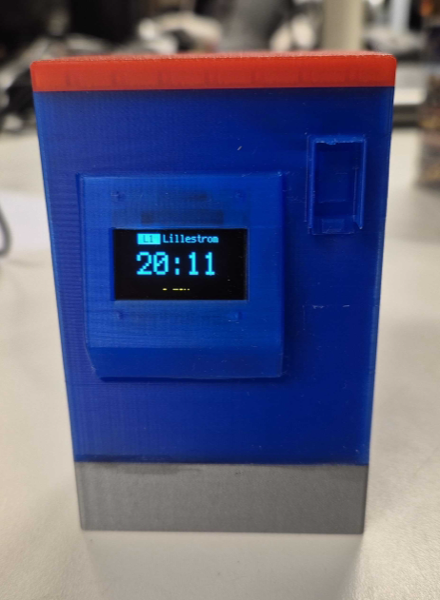

# TVM Pico

A Raspberry Pi Pico W project that displays the next train departure on a small OLED screen. It queries the [Entur](https://entur.no) journey planner API for upcoming trips and shows the departure time and minutes remaining.



## Hardware

- Raspberry Pi Pico W running CircuitPython
- SSD1306 128x64 OLED display (I2C)

## Setup

1. Install [CircuitPython](https://circuitpython.org/) on the Pico W
2. Connect the device to your computer via USB
3. Copy the `lib/` dependencies to the device
4. Create a `settings.toml` on the device with your WiFi credentials. Multiple networks are supported — the device scans and connects to the first available one:
   ```toml
   WIFI_SSID_0 = "your_ssid"
   WIFI_PASSWORD_0 = "your_password"
   WIFI_SSID_1 = "another_ssid"
   WIFI_PASSWORD_1 = "another_password"
   ```
5. Deploy with `./sync.sh`

## Configuration

Edit the GraphQL query in `code.py` to change the origin/destination stop places. Stop place IDs can be found via the [National Stop Place Register](https://stoppested.entur.org/).
